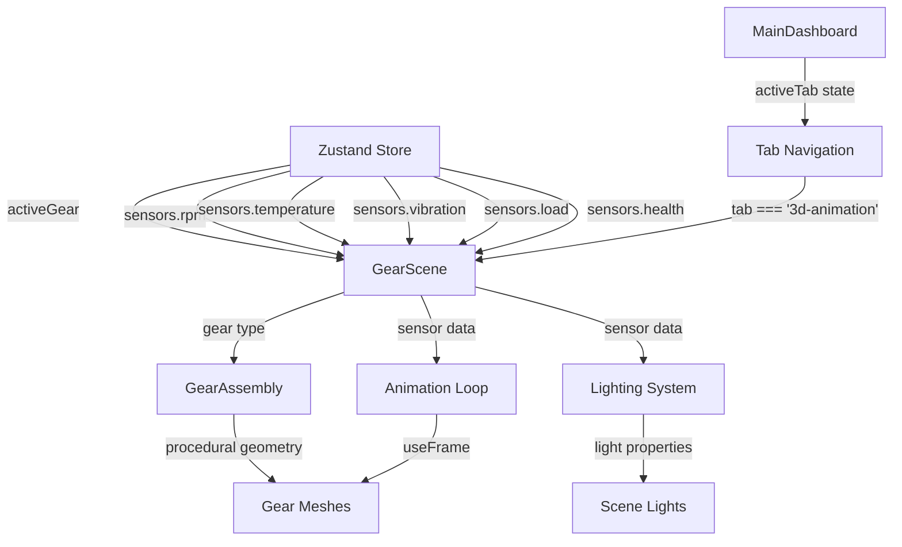

# Design Document: 3D Gear Animation Tab

## Overview

The 3D Gear Animation Tab is a production-ready React component that renders industrial gear types (Spur, Helical, Bevel, Worm) using Three.js and React Three Fiber. The component is integrated as a tab in the MainDashboard, appearing after the "What If Optimizer" tab, providing real-time 3D visualization of gears with procedurally generated geometry, sensor data integration from a Zustand store, and a complete factory environment with dynamic lighting and atmospheric effects.

### Key Features

- **Four Gear Types**: Spur, Helical, Bevel, and Worm gears with accurate mechanical geometry
- **Procedural Geometry**: All geometry generated programmatically without external 3D models
- **Real-Time Sensor Integration**: Rotation speed, temperature, vibration, and load data from Zustand store
- **Factory Environment**: Industrial setting with floor, walls, structural elements, and atmospheric particles
- **Dynamic Lighting**: Sensor-responsive lighting system with shadows and environment mapping
- **Smooth Transitions**: Animated gear switching with camera movements
- **Interactive Controls**: Orbit camera with zoom constraints
- **Tab-Based Integration**: Appears as a tab in the MainDashboard after "What If Optimizer"

### Technology Stack

- **React 19.2.4**: Component framework
- **Three.js 0.183.2**: 3D graphics library (r128 compatible)
- **@react-three/fiber 9.6.0**: React renderer for Three.js
- **@react-three/drei 10.7.7**: Helper components (OrbitControls, Text, Environment, etc.)
- **@react-spring/three**: Spring-based animations for camera transitions
- **framer-motion 12.38.0**: Transition animations for gear switching
- **Zustand**: State management (to be created)

## Architecture

### Dashboard Integration

The 3D Gear Animation is integrated as a tab in the MainDashboard component, positioned after the "What If Optimizer" tab. This approach provides seamless access to the 3D visualization without requiring separate routing or sidebar navigation.

**Integration Approach**:

1. **Tab-Based Navigation**: The GearScene component is rendered conditionally based on the `activeTab` state in MainDashboard
2. **No Routing Required**: Unlike other pages (Design Parameters, Reliability Data, etc.), the 3D animation lives within the MainDashboard tab system
3. **State Preservation**: Switching between tabs preserves the dashboard state (gear type, sensor values, predictions)
4. **Consistent UX**: Users can quickly switch between health metrics, SHAP analysis, and 3D visualization without page navigation

**Tab Structure**:
```
MainDashboard
├── Tab Navigation Bar
│   ├── 🎯 Gear Health
│   ├── 🔍 SHAP + LIME
│   ├── 📈 Trends & History
│   ├── 🔧 What-If Optimizer
│   ├── 🎨 3D Gear Animation (NEW TAB - positioned here)
│   ├── 💰 Cost Impact
│   └── 📊 Model Comparison
└── Tab Content Area
    └── GearScene (when activeTab === '3d-animation')
```

**Why Tab-Based Instead of Sidebar Navigation?**

- **Contextual Relevance**: The 3D visualization is directly related to the current gear being analyzed in the dashboard
- **Faster Access**: No page reload or route change required
- **Shared State**: Automatically uses the same gear type and sensor data from the dashboard
- **Better UX Flow**: Users can quickly compare health metrics with 3D visualization
- **Reduced Complexity**: No need for route parameters or state passing between pages

### Component Hierarchy

```
GearScene (Canvas wrapper)
├── Scene (R3F Scene component)
│   ├── Lighting
│   │   ├── AmbientLight
│   │   ├── SpotLight × 3 (key + fill lights)
│   │   └── PointLight (sensor-responsive)
│   ├── Environment
│   │   ├── Floor (PlaneGeometry + checker texture)
│   │   ├── GridHelper
│   │   ├── Walls (back + left panels)
│   │   └── Columns (BoxGeometry I-beams)
│   ├── AtmosphericParticles (Points)
│   ├── GearAssembly (AnimatePresence wrapper)
│   │   ├── SpurGearPair
│   │   ├── HelicalGearPair
│   │   ├── BevelGearPair
│   │   └── WormGearAssembly
│   ├── HUD3D (Text components)
│   └── OrbitControls
└── Camera (PerspectiveCamera)
```

### Data Flow



## Components and Interfaces

### 1. GearScene Component

**File**: `dashboard/src/components/GearScene.jsx`

**Purpose**: Main component that wraps the Three.js Canvas and manages the 3D scene. Integrated as a tab in the MainDashboard.

**Interface**:
```javascript
export default function GearScene() {
  // No props - reads from Zustand store
  return <Canvas>...</Canvas>
}
```

**Integration Pattern**:
```javascript
// In MainDashboard.jsx
const TABS = [
  { id: 'health',    label: '🎯  Gear Health' },
  { id: 'xai',      label: '🔍  SHAP + LIME' },
  { id: 'history',  label: '📈  Trends & History' },
  { id: 'optimizer',label: '🔧  What-If Optimizer' },
  { id: '3d-animation', label: '🎨  3D Gear Animation' }, // NEW TAB
  { id: 'cost',     label: '💰  Cost Impact' },
  { id: 'models',   label: '📊  Model Comparison' },
];

// Tab content rendering
{activeTab === '3d-animation' && <GearScene />}
```

**Responsibilities**:
- Initialize Three.js Canvas with appropriate settings
- Set up camera with initial position and FOV
- Render Scene component
- Handle canvas resize and pixel ratio
- Integrate seamlessly with MainDashboard tab navigation

### 2. Scene Component

**File**: `dashboard/src/components/GearScene.jsx` (internal)

**Purpose**: Contains all 3D objects, lighting, and animation logic.

**Interface**:
```javascript
function Scene() {
  const { activeGear, sensors } = useGearStore();
  // Render scene contents
}
```

**Responsibilities**:
- Read state from Zustand store
- Manage gear switching with AnimatePresence
- Coordinate lighting updates based on sensor data
- Render environment, gears, and HUD

### 3. Gear Components

Each gear type is a separate component that generates procedural geometry.

#### SpurGearPair

**Interface**:
```javascript
function SpurGearPair({ rpm, vibration, health }) {
  // Generate and animate two meshing spur gears
}
```

**Geometry**:
- Base: `CylinderGeometry(radius=2, height=0.5, segments=32)`
- Teeth: 16 × `BoxGeometry(width=0.3, height=0.8, depth=0.5)`
- Teeth arranged radially at 22.5° intervals
- Second gear offset by 4.2 units, counter-rotating

#### HelicalGearPair

**Interface**:
```javascript
function HelicalGearPair({ rpm, vibration, health }) {
  // Generate and animate two meshing helical gears
}
```

**Geometry**:
- Base: `CylinderGeometry(radius=2, height=0.6, segments=32)`
- Teeth: `ExtrudeGeometry` with helical path (15° helix angle)
- 18 teeth twisted along helical curve
- Two gears with opposite hand helices
- Axial oscillation: `position.y += sin(time) * 0.05`

#### BevelGearPair

**Interface**:
```javascript
function BevelGearPair({ rpm, vibration, health }) {
  // Generate and animate two meshing bevel gears
}
```

**Geometry**:
- Base: `ConeGeometry(radiusTop=1.5, radiusBottom=2.5, height=1.5, segments=32, openEnded=false)`
- Teeth: Tapered `BoxGeometry` positioned along slant face
- 14 teeth arranged around cone perimeter
- Mating gear rotated 90° on X axis
- Pitch cone apex at origin

#### WormGearAssembly

**Interface**:
```javascript
function WormGearAssembly({ rpm, vibration, health }) {
  // Generate and animate worm shaft + wheel
}
```

**Geometry**:
- Worm shaft: `CylinderGeometry(radius=0.4, height=4, segments=16)`
- Spiral ridge: `TubeGeometry` along helical parametric curve
  - Curve: `x = cos(t), y = sin(t), z = t * pitch`
  - Radius: 0.15, tubular segments: 64
- Worm wheel: Standard spur gear (20 teeth)
- Worm on Z axis, wheel on Y axis
- Rotation ratio: 20:1 (worm drives wheel)

### 4. Lighting System

**Components**:
- `AmbientLight`: Base illumination (intensity 0.3, color #ffffff)
- `SpotLight` × 3:
  - Key light: position [5, 8, 5], intensity 1.2, color #fff5e6 (warm)
  - Fill light 1: position [-4, 6, 3], intensity 0.6, color #e6f2ff (cool)
  - Fill light 2: position [2, 5, -4], intensity 0.5, color #e6f2ff (cool)
- `PointLight`: position [0, 2, 0], sensor-responsive

**Sensor Integration**:
- **Temperature** (65-95°C): PointLight color interpolation
  - 65°C: `#ff6b35`
  - 95°C: `#ff2200`
  - Formula: `lerpColor(temp, 65, 95, '#ff6b35', '#ff2200')`
- **Load** (0-100%): SpotLight intensity interpolation
  - 0%: intensity 0.8
  - 100%: intensity 1.8
  - Formula: `0.8 + (load / 100) * 1.0`
- **Health Status**:
  - `warning`: PointLight blinks (opacity oscillates 0.3-1.0)
  - `critical`: PointLight solid red (#ff0000)

### 5. Environment Components

#### Floor

**Geometry**: `PlaneGeometry(40, 40)`

**Material**: `MeshStandardMaterial` with canvas-generated checker texture
```javascript
const canvas = document.createElement('canvas');
canvas.width = canvas.height = 512;
const ctx = canvas.getContext('2d');
const tileSize = 64;
for (let y = 0; y < 8; y++) {
  for (let x = 0; x < 8; x++) {
    ctx.fillStyle = (x + y) % 2 === 0 ? '#1a2030' : '#141824';
    ctx.fillRect(x * tileSize, y * tileSize, tileSize, tileSize);
  }
}
const texture = new THREE.CanvasTexture(canvas);
texture.wrapS = texture.wrapT = THREE.RepeatWrapping;
texture.repeat.set(4, 4);
```

**Properties**: `receiveShadow = true`, rotation `[-Math.PI / 2, 0, 0]`

#### Walls

**Back Wall**: `PlaneGeometry(40, 20)`, position `[0, 10, -20]`, color `#1c2333`

**Left Wall**: `PlaneGeometry(40, 20)`, position `[-20, 10, 0]`, rotation `[0, Math.PI / 2, 0]`, color `#1c2333`

#### Columns

**Geometry**: `BoxGeometry(0.4, 18, 0.4)`

**Positions**: 
- `[-18, 9, -18]` (back-left)
- `[18, 9, -18]` (back-right)
- `[-18, 9, 18]` (front-left)

**Material**: `MeshStandardMaterial({ color: '#2a3447', metalness: 0.6, roughness: 0.4 })`

#### GridHelper

**Parameters**: `size = 40, divisions = 40, colorCenterLine = #3a4a5c, colorGrid = #2a3447`

**Position**: `[0, 0.01, 0]` (slightly above floor to prevent z-fighting)

### 6. Atmospheric Particles

**Geometry**: `BufferGeometry` with 200 points

**Positions**: Random distribution in volume `[-15, 15] × [0, 15] × [-15, 15]`

**Material**: `PointsMaterial({ size: 0.05, color: #ffffff, opacity: 0.3, transparent: true })`

**Animation**: Drift upward with `position.y += 0.01`, wrap at y = 15 back to y = 0

### 7. HUD3D Component

**Purpose**: Display gear name and RPM in 3D space

**Components**:
- Gear name: `<Text>` from drei, position `[-3, 4, 0]`, fontSize 0.4
- RPM value: `<Text>` from drei, position `[-3, 3.5, 0]`, fontSize 0.3

**Material**: `MeshStandardMaterial({ color: #05cd99, emissive: #05cd99, emissiveIntensity: 0.5 })`

**Update**: Re-render when `activeGear` or `sensors.rpm` changes

### 8. OrbitControls

**Configuration**:
```javascript
<OrbitControls
  enablePan={false}
  minDistance={3}
  maxDistance={12}
  minPolarAngle={Math.PI / 6}
  maxPolarAngle={Math.PI / 2.2}
  target={[0, 1, 0]}
/>
```

**Behavior**: User can orbit around gear center, zoom in/out within constraints, no panning

## Data Models

### Zustand Store Structure

**File**: `dashboard/src/store/gearStore.js`

```javascript
import { create } from 'zustand';

export const useGearStore = create((set) => ({
  // Active gear type
  activeGear: 'Spur', // 'Spur' | 'Helical' | 'Bevel' | 'Worm'
  
  // Sensor data
  sensors: {
    rpm: 1950,           // Revolutions per minute (0-3000)
    temperature: 72,     // Celsius (20-120)
    vibration: 2.3,      // mm/s RMS (0-10)
    load: 45,            // Percentage (0-100)
    health: 'normal',    // 'normal' | 'warning' | 'critical'
  },
  
  // Actions
  setActiveGear: (gear) => set({ activeGear: gear }),
  updateSensors: (sensorData) => set((state) => ({
    sensors: { ...state.sensors, ...sensorData }
  })),
}));
```

### Gear Geometry Parameters

**Spur Gear**:
```javascript
{
  baseRadius: 2.0,
  baseHeight: 0.5,
  teethCount: 16,
  toothWidth: 0.3,
  toothHeight: 0.8,
  toothDepth: 0.5,
  centerDistance: 4.2, // Distance between meshing gears
}
```

**Helical Gear**:
```javascript
{
  baseRadius: 2.0,
  baseHeight: 0.6,
  teethCount: 18,
  helixAngle: 15, // degrees
  toothProfile: 'involute',
  axialOscillation: 0.05, // amplitude
  centerDistance: 4.3,
}
```

**Bevel Gear**:
```javascript
{
  radiusTop: 1.5,
  radiusBottom: 2.5,
  height: 1.5,
  teethCount: 14,
  pitchAngle: 90, // degrees
  toothTaper: 0.7, // ratio
  apexPosition: [0, 0, 0],
}
```

**Worm Gear**:
```javascript
{
  wormRadius: 0.4,
  wormLength: 4.0,
  threadPitch: 0.5,
  threadRadius: 0.15,
  wheelTeeth: 20,
  wheelRadius: 2.0,
  gearRatio: 20, // worm:wheel
}
```

## Error Handling

### Geometry Generation Errors

**Issue**: Procedural geometry generation fails due to invalid parameters

**Handling**:
- Validate all geometry parameters before generation
- Use try-catch blocks around geometry creation
- Fall back to simple placeholder geometry (cylinder) on error
- Log error to console with descriptive message

```javascript
function createGearGeometry(params) {
  try {
    validateParams(params);
    return generateGear(params);
  } catch (error) {
    console.error('Gear geometry generation failed:', error);
    return new THREE.CylinderGeometry(2, 2, 0.5, 16); // Fallback
  }
}
```

### Store Connection Errors

**Issue**: Zustand store not available or returns undefined

**Handling**:
- Provide default values for all store reads
- Use optional chaining and nullish coalescing
- Display warning in console if store is unavailable

```javascript
const { activeGear = 'Spur', sensors = DEFAULT_SENSORS } = useGearStore?.() ?? {};
```

### Three.js Compatibility Errors

**Issue**: API incompatibility with Three.js r128

**Handling**:
- Use only r128-compatible APIs (avoid deprecated methods)
- Test with exact Three.js version 0.183.2
- Provide polyfills for missing features if needed

### Animation Loop Errors

**Issue**: useFrame callback throws error

**Handling**:
- Wrap useFrame logic in try-catch
- Prevent error from crashing entire scene
- Log error and skip frame update

```javascript
useFrame((state, delta) => {
  try {
    updateGearRotation(delta);
    updateVibration(state.clock.elapsedTime);
  } catch (error) {
    console.error('Animation frame error:', error);
  }
});
```

### Resource Disposal Errors

**Issue**: Memory leaks from undisposed geometries/materials

**Handling**:
- Use useEffect cleanup to dispose resources
- Dispose geometries and materials when gear type changes
- Track all created resources for cleanup

```javascript
useEffect(() => {
  const resources = createGearResources();
  return () => {
    resources.forEach(r => r.dispose());
  };
}, [activeGear]);
```

## Testing Strategy

This feature involves 3D rendering, UI visualization, and real-time animation, which makes property-based testing inappropriate. The testing strategy focuses on:

### Unit Tests

**Geometry Generation Functions**:
- Test `createSpurGear()` returns valid geometry with correct vertex count
- Test `createHelicalGear()` generates twisted teeth at 15° helix angle
- Test `createBevelGear()` produces conical frustum with tapered teeth
- Test `createWormGear()` creates spiral ridge along helical curve
- Test parameter validation rejects invalid inputs (negative radius, zero teeth)

**Utility Functions**:
- Test `lerpColor(temp, min, max, color1, color2)` interpolates colors correctly
- Test `calculateGearRatio(worm, wheel)` returns 20:1 for worm gear
- Test `radialPosition(index, count, radius)` distributes teeth evenly
- Test `helixCurve(t, pitch, radius)` generates correct parametric curve

**Store Integration**:
- Test `useGearStore` initializes with default values
- Test `setActiveGear()` updates activeGear state
- Test `updateSensors()` merges sensor data correctly
- Test store provides fallback values when undefined

### Integration Tests

**Component Rendering**:
- Test `<GearScene />` renders Canvas without errors
- Test scene switches between all four gear types
- Test sensor data updates trigger re-renders
- Test OrbitControls responds to user interaction

**Sensor Data Flow**:
- Test RPM changes update gear rotation speed
- Test temperature changes update PointLight color
- Test vibration changes apply mesh shake effect
- Test load changes update SpotLight intensity
- Test health status changes trigger visual alerts

**Transition Animations**:
- Test gear switching uses AnimatePresence fade transition
- Test camera position animates smoothly with useSpring
- Test scene lighting persists during transitions

### Visual Regression Tests

**Snapshot Tests**:
- Capture screenshots of each gear type in default state
- Compare against baseline images to detect visual regressions
- Test lighting configurations (normal, warning, critical)
- Test environment rendering (floor, walls, particles)

### Performance Tests

**Frame Rate Monitoring**:
- Measure FPS during continuous animation (target: 60 FPS)
- Test performance with all sensor data updating simultaneously
- Monitor memory usage during gear switching
- Verify resource disposal prevents memory leaks

**Geometry Complexity**:
- Measure vertex count for each gear type (target: < 50k vertices)
- Test render time for procedural geometry generation
- Verify mesh merging reduces draw calls

### Manual Testing Checklist

- [ ] All four gear types render correctly
- [ ] Meshing gears rotate in sync with correct ratios
- [ ] Sensor data updates reflect in visualization
- [ ] Health status alerts display correctly (warning blink, critical red)
- [ ] Camera controls work smoothly (orbit, zoom)
- [ ] Transitions between gear types are smooth
- [ ] Factory environment renders with proper lighting
- [ ] Atmospheric particles animate correctly
- [ ] 3D HUD displays current gear name and RPM
- [ ] Shadows cast and receive properly
- [ ] No console errors or warnings
- [ ] Performance remains smooth (60 FPS)

### Test Environment

- **Browser**: Chrome 120+, Firefox 120+, Safari 17+
- **Three.js**: Version 0.183.2 (r128 compatible)
- **React**: Version 19.2.4
- **Testing Library**: @testing-library/react 16.3.2
- **Test Runner**: Vitest 4.1.4

### Testing Tools

- **Vitest**: Unit and integration test runner
- **@testing-library/react**: Component testing utilities
- **jsdom**: DOM environment for tests
- **Manual inspection**: Visual verification in browser

## Performance Optimization Strategies

### 1. Geometry Optimization

**Mesh Merging**:
- Merge all teeth geometries into single mesh per gear
- Use `BufferGeometryUtils.mergeGeometries()` to combine teeth
- Reduces draw calls from 16-20 per gear to 1-2

**Geometry Reuse**:
- Cache base geometries (cylinders, cones) for reuse
- Share materials across similar meshes
- Dispose old geometries when switching gear types

**Level of Detail (LOD)**:
- Reduce tooth count for distant camera views
- Simplify geometry when camera distance > 8 units
- Use `THREE.LOD` to manage detail levels

### 2. Material Optimization

**Material Sharing**:
- Create single `MeshStandardMaterial` instance for all gears
- Reuse material across multiple meshes
- Update material properties instead of creating new materials

**Texture Optimization**:
- Generate checker texture once, reuse for floor
- Use power-of-2 texture dimensions (512×512)
- Enable texture caching with `texture.needsUpdate = false`

### 3. Rendering Optimization

**Shadow Optimization**:
- Limit shadow-casting lights to 2 (key SpotLight + PointLight)
- Use lower shadow map resolution (1024×1024)
- Disable shadows for small objects (particles, HUD)

**Frustum Culling**:
- Enable automatic frustum culling (default in Three.js)
- Ensure all objects have proper bounding boxes
- Remove objects outside camera view from render

**Render Order**:
- Render opaque objects first (gears, environment)
- Render transparent objects last (particles)
- Minimize state changes between draw calls

### 4. Animation Optimization

**Frame Rate Limiting**:
- Use `useFrame` with delta time for consistent animation
- Skip expensive calculations when delta < threshold
- Throttle sensor data updates to 10 Hz (every 100ms)

**Animation Batching**:
- Update all gear rotations in single useFrame callback
- Batch light property updates
- Avoid triggering React re-renders from animation loop

### 5. Memory Management

**Resource Disposal**:
- Dispose geometries when gear type changes
- Dispose materials when component unmounts
- Clear texture memory when switching scenes

**Garbage Collection**:
- Nullify references to disposed objects
- Use WeakMap for temporary object storage
- Avoid creating objects in animation loop

### 6. Code Splitting

**Lazy Loading**:
- Lazy load gear components with `React.lazy()`
- Load only active gear type geometry
- Preload next gear type in background

**Bundle Optimization**:
- Tree-shake unused Three.js modules
- Use named imports from drei
- Minimize bundle size with Vite optimization

### 7. Sensor Data Optimization

**Debouncing**:
- Debounce sensor updates to reduce re-renders
- Use `useMemo` for expensive calculations
- Cache interpolated values (colors, intensities)

**Selective Updates**:
- Only update affected components when sensor changes
- Use React.memo for static components
- Avoid unnecessary prop drilling

### Performance Targets

- **Frame Rate**: 60 FPS sustained during animation
- **Initial Load**: < 2 seconds to first render
- **Gear Switch**: < 500ms transition time
- **Memory**: < 100 MB total scene memory
- **Draw Calls**: < 50 per frame
- **Vertices**: < 50,000 total per scene

## Implementation Notes

### Tab-Based Integration Pattern

The GearScene component is integrated into MainDashboard using a tab-based approach rather than route-based navigation. This requires specific implementation considerations:

**MainDashboard.jsx Changes**:

1. **Add Tab Definition**:
```javascript
const TABS = [
  { id: 'health',    label: '🎯  Gear Health' },
  { id: 'xai',      label: '🔍  SHAP + LIME' },
  { id: 'history',  label: '📈  Trends & History' },
  { id: 'optimizer',label: '🔧  What-If Optimizer' },
  { id: '3d-animation', label: '🎨  3D Gear Animation' }, // NEW
  { id: 'cost',     label: '💰  Cost Impact' },
  { id: 'models',   label: '📊  Model Comparison' },
];
```

2. **Add Conditional Rendering**:
```javascript
{/* After optimizer tab content */}
{activeTab === '3d-animation' && (
  <div className="fade-in">
    <GearScene />
  </div>
)}
```

3. **Import GearScene**:
```javascript
import GearScene from '../components/GearScene';
```

**Benefits of Tab Integration**:
- No route configuration needed in App.jsx
- No sidebar navigation item required
- Automatic state sharing with dashboard (gear type, sensors)
- Faster switching between views (no page reload)
- Consistent with other dashboard sections (SHAP, Optimizer, Cost)

**Removed Approach** (Previous Design):
- ~~Sidebar navigation item for "3D Gear Animation"~~
- ~~Route definition in App.jsx for '/gear-animation'~~
- ~~Separate page component approach~~

### Three.js r128 Compatibility

The requirements specify Three.js r128 compatibility. The current package.json shows Three.js 0.183.2, which corresponds to r183. This is a much newer version than r128. Key considerations:

1. **API Changes**: Three.js r183 includes breaking changes from r128
2. **Recommendation**: Update requirements to use r183 APIs, or downgrade Three.js to r128
3. **Compatibility Layer**: If r128 is required, create adapter functions for API differences

### Procedural Geometry Generation

All geometry must be generated procedurally without external models. Key algorithms:

**Spur Gear Teeth**:
```javascript
function createSpurTeeth(baseRadius, teethCount, toothHeight, toothWidth, toothDepth) {
  const teeth = [];
  const angleStep = (Math.PI * 2) / teethCount;
  
  for (let i = 0; i < teethCount; i++) {
    const angle = i * angleStep;
    const tooth = new THREE.BoxGeometry(toothWidth, toothHeight, toothDepth);
    tooth.translate(
      Math.cos(angle) * (baseRadius + toothHeight / 2),
      0,
      Math.sin(angle) * (baseRadius + toothHeight / 2)
    );
    tooth.rotateY(angle);
    teeth.push(tooth);
  }
  
  return BufferGeometryUtils.mergeGeometries(teeth);
}
```

**Helical Teeth**:
```javascript
function createHelicalTooth(helixAngle, height) {
  const shape = new THREE.Shape();
  // Define involute tooth profile
  shape.moveTo(0, 0);
  shape.lineTo(0.3, 0);
  shape.lineTo(0.25, 0.8);
  shape.lineTo(0.05, 0.8);
  shape.lineTo(0, 0);
  
  const extrudeSettings = {
    steps: 20,
    depth: height,
    bevelEnabled: false,
    extrudePath: createHelixCurve(helixAngle, height),
  };
  
  return new THREE.ExtrudeGeometry(shape, extrudeSettings);
}

function createHelixCurve(angle, height) {
  const curve = new THREE.CatmullRomCurve3(
    Array.from({ length: 21 }, (_, i) => {
      const t = i / 20;
      const twist = t * angle * (Math.PI / 180);
      return new THREE.Vector3(
        Math.cos(twist) * 2,
        t * height,
        Math.sin(twist) * 2
      );
    })
  );
  return curve;
}
```

**Worm Spiral Ridge**:
```javascript
function createWormSpiral(radius, length, pitch, threadRadius) {
  const turns = length / pitch;
  const segments = Math.floor(turns * 64);
  
  const curve = new THREE.CatmullRomCurve3(
    Array.from({ length: segments + 1 }, (_, i) => {
      const t = i / segments;
      const angle = t * turns * Math.PI * 2;
      return new THREE.Vector3(
        Math.cos(angle) * radius,
        Math.sin(angle) * radius,
        t * length - length / 2
      );
    })
  );
  
  return new THREE.TubeGeometry(curve, segments, threadRadius, 8, false);
}
```

### Camera Transition Animation

Use @react-spring/three for smooth camera movements:

```javascript
import { useSpring, animated } from '@react-spring/three';

function Scene() {
  const { activeGear } = useGearStore();
  
  const cameraPositions = {
    Spur: [5, 3, 5],
    Helical: [6, 4, 4],
    Bevel: [4, 5, 6],
    Worm: [7, 3, 3],
  };
  
  const springProps = useSpring({
    position: cameraPositions[activeGear],
    config: { tension: 120, friction: 14 },
  });
  
  return (
    <animated.group position={springProps.position}>
      <PerspectiveCamera makeDefault />
    </animated.group>
  );
}
```

### Sensor Data Integration Pattern

```javascript
function GearMesh({ type }) {
  const { sensors } = useGearStore();
  const meshRef = useRef();
  
  useFrame((state, delta) => {
    if (!meshRef.current) return;
    
    // Rotation based on RPM
    const rotationSpeed = (sensors.rpm / 60) * delta * Math.PI * 2;
    meshRef.current.rotation.z += rotationSpeed;
    
    // Vibration effect
    const vibrationAmount = sensors.vibration * 0.01;
    const healthMultiplier = sensors.health === 'critical' ? 3 : 1;
    meshRef.current.position.x = Math.sin(state.clock.elapsedTime * 10) * vibrationAmount * healthMultiplier;
  });
  
  return <mesh ref={meshRef}>...</mesh>;
}
```

This design document provides a comprehensive blueprint for implementing the 3D Gear Animation Tab feature with all necessary technical details, architecture decisions, and implementation guidance.

